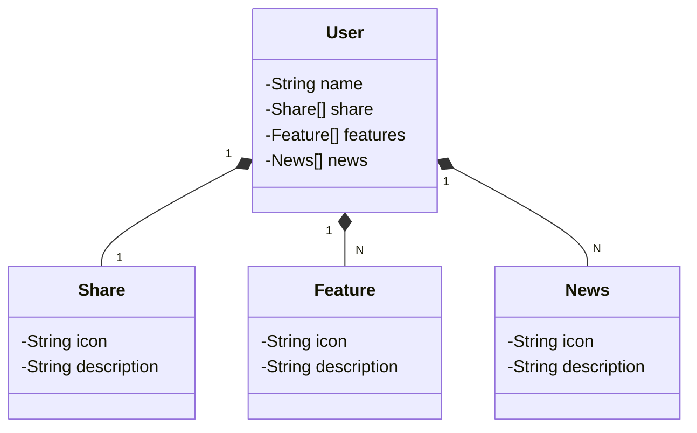

# bibliotecaOnlineTelaWishList
biblioteca Online Tela WishList
## Saiba mais sobre o projeto
RESTful API para wishList
O objetivo é realizar a integracao para uma pagina de wish list de livros de uma biblioteca online

  

## Diagrama de Classes (Domínio da API)

